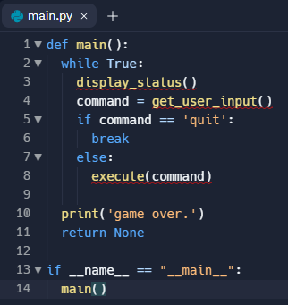
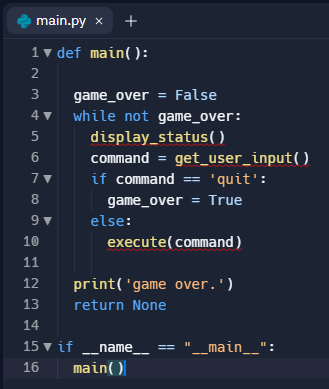

# Dev Journal.
## Nov 12, 2022
### EngineerBob made the following changes...

The accepted practice is to use,

if __name__ == "__main__":
  main()

as the outer most indent to kick off execution. There are plenty of excelent google/youtube pages that explain why.  Basically it has to do with how code in larger packages with multiple files is managed.

This meant that start() got renamed to main().

Both start() (now main()) and check_resources() had calls to start() (now main()).  This is a good way to just keep allocating resources endlessly. Python will limit this by throwing a RecursionError: maximum recurrsion depth exceeded.

Here's a simple example.

It's pretty common for code to have a "main loop" or "game loop" that will execute until some condition causes the loop to end.

There are a couple of ways to implement this, but here are two simple ones,

and a second example,

This allows repeated execution of the same game code, but doesn't call the main() function (which creates an all new context (scope) and eats away resources).

So I put while True: loop around the main game code.

To address the call to start in check_resources() I did a couple of things.  First, The function now checks the resources, and just returns True or False.

Also, in the previous implementation, if multiple items were too low, the check_resources function would only report that the first "low" resource encountered was low. No the function reports on all of the items that were low.

Process_admin() had the same recursive (circular) calls. Fixed that with a "while True:" loop.  Exit happens either upon "homepage" or "off" being entered by the player. Also removed the exit() call from process_admin(). Unless there is some error that is tough to handle, exit() calls are sort of frowned up on because in addition to the message passed to them (like exit("I'm quitting now...")) being printed ("I'm quitting now..."), they also say ugly stuff like, "repl process died unexpectedly: exit status 1".  So if the user enters "off" to quit, process_admin() returns the string, "quit" and then main() just checks for that option and gracefully quits.

Over all, fixed the indenting to use a single indent (not double or triple).  The issue with double or triple indents is that they eat up horizontal space and a "best practice" for Python is to keep line lengths below 80 characters.

---
## Nov 13, 2022
### From TopAchivers
thank you sir for the update please can we connect on [github](https://github.com/Rachamv) also i want us to chat together about how we can turn this project into a real life project 

---

## Nov 14, 2022
## From TopAchivers
In this version we are using OOP method to add new features 
this version is propose for organisation that have remote workers and want to provide them with virtual coffee machine.
* Admin = employer(features
* * Ability to see records of each buyer(employee) for each (weeks/months)
  * Ability to set price)
* Chatroom for employee
* More features latter 

## MenuItemAttributes:
## Class
-
### name

(str) The name of the drink.
e.g. “latte”
-
### cost
(float) The price of the drink.
e.g 1.5
-
### ingredients
(dictionary) The ingredients and amounts required to make the drink.
e.g. {“water”: 100, “coffee”: 16}

## Menu Class
## Methods:
-
### get_items()

Returns all the names of the available menu items as a concatenated string.
e.g. “latte/espresso/cappuccino”
-
### find_drink(order_name)

Parameter order_name: (str) The name of the drinks order.
Searches the menu for a particular drink by name. 
Returns a MenuItem object if it exists,
otherwise returns None.

### CoffeeMakerMethods:
### Class
-
### report()

Prints a report of all resources.
e.g.

Water: 300ml,

Milk: 200ml,

Coffee: 100g

-
### is_resource_sufficient(drink)

Parameter drink: (MenuItem) The MenuItem object to make.
Returns True when the drink order can be made, False if ingredients are insufficient.
e.g.
True
-
### make_coffee(order)

Parameter order: (MenuItem) The MenuItem object to make.
Deducts the required ingredients from the resources.

### MoneyMachineMethods:
### Class
-
### report()

Prints the current profit
e.g.
Money: $0
-
### make_payment(cost)

Parameter cost: (float) The cost of the drink.
Returns True when payment is accepted, or False if insufficient.
e.g. False
-
## Test room
https://replit.com/@TopAchievers/VCM-version-2-test?v=1